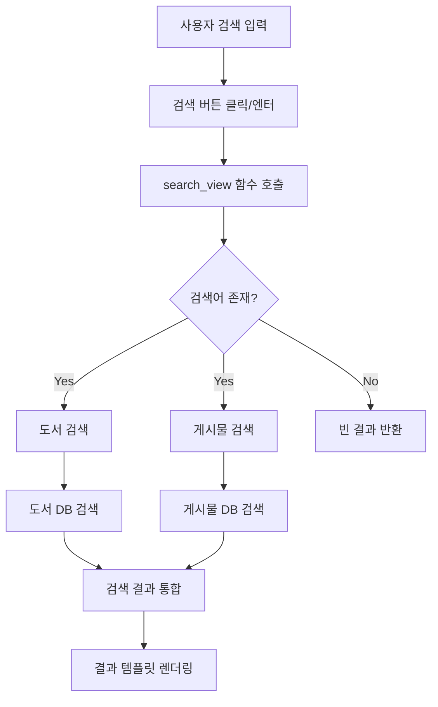
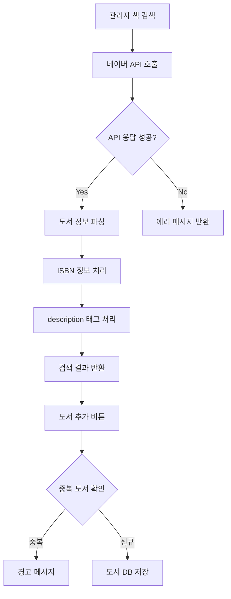
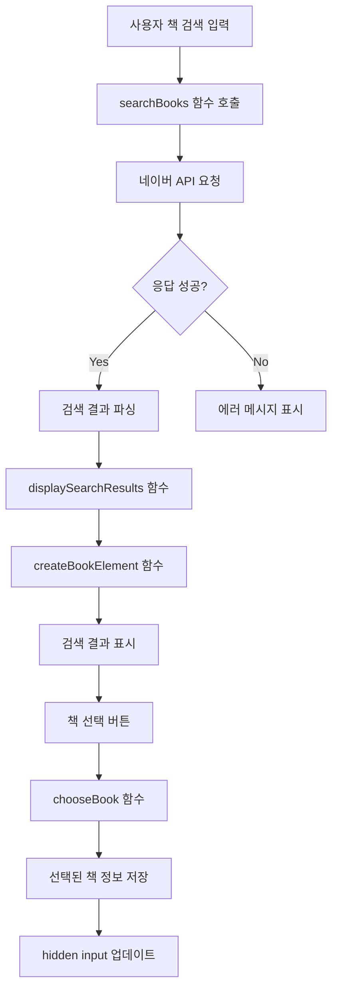

# 검색 기능 로직

## 1. 일반 검색 구조도



## 1-1. 관리자 책 검색 구조도




## 1-2. post.html에서의 책 검색 구조도


## 2. 책 검색 프로세스

### 2.1 검색 구조도



### 2.2 검색 프로세스 상세 설명

#### 2.2.1 검색 이벤트 처리
- **검색 입력 처리**
  - 검색어 입력 필드 (`book-search-input`)                // 사용자 입력 필드
  - 검색 버튼 클릭 또는 엔터키 이벤트                      // 이벤트 트리거
  - 빈 검색어 검증                                       // 입력값 유효성 검사

```javascript
function handleKeyPress(event) {
    if (event.key === 'Enter') {
        searchBooks();
    }
}

function searchBooks() {
    const query = document.getElementById('book-search-input').value.trim();
    if(!query){
        alert("검색어를 입력하세요!");
        return;
    }
    // API 호출 로직
}
```

#### 2.2.2 API 요청 및 결과 처리
- **네이버 API 호출**
  - fetch API 사용                                      // 비동기 요청 처리
  - 에러 처리                                           // 예외 상황 관리
  - 응답 데이터 파싱                                     // JSON 데이터 처리

```javascript
function searchBooks() {
    // ... existing code ...
    fetch(`/naver-book-json/?query=${encodeURIComponent(query)}`)
    .then(response => {
        if(!response.ok) throw new Error('Network response was not ok');
        return response.json();
    })
    .then(data => {
        if (data?.items) displaySearchResults(data.items);
        else document.getElementById('search-results').innerHTML = '<p>검색 결과가 없습니다.</p>';
    })
}
```

#### 2.2.3 검색 결과 표시
- **결과 렌더링**
  - 책 정보 요소 생성                                    // DOM 요소 생성
  - 이미지 및 메타데이터 표시                            // 시각적 정보 표시
  - 선택 버튼 추가                                      // 상호작용 요소

```javascript
function createBookElement(book) {
    const bookDiv = document.createElement('div');
    bookDiv.innerHTML = `
        <strong>${book.title}</strong>
        <div>저자: ${book.author}</div>
        <div>출판사: ${book.publisher}</div>
        
        <button onclick="chooseBook(${JSON.stringify(book)})">이 책 선택</button>
    `;
    return bookDiv;
}
```

#### 2.2.4 책 선택 처리
- **선택 데이터 관리**
  - 선택된 책 정보 JSON 변환                             // 데이터 직렬화
  - hidden input 업데이트                               // 폼 데이터 관리
  - 사용자 피드백 제공                                   // UI 피드백

```javascript
function chooseBook(book) {
    const selectedBookData = JSON.stringify({
        title: book.title,
        author: book.author,
        publisher: book.publisher,
        pubdate: book.pubdate,
        link: book.link,
        thumbnail_url: book.image,
        isbn: book.isbn,
        description: book.description
    });
    document.getElementById('selected_book_data').value = selectedBookData;
    alert(`'${book.title}' 책이 선택되었습니다.`);
}
```

### 2.3 특징 및 장점

#### 2.3.1 사용자 경험
- 실시간 검색 결과 표시                                  // 즉각적인 응답
- 시각적 피드백 제공                                    // 사용자 상호작용
- 직관적인 책 선택 인터페이스                            // 사용성 향상

#### 2.3.2 데이터 처리
- 비동기 API 호출                                      // 성능 최적화
- 에러 처리 및 예외 관리                                // 안정성 확보
- 구조화된 데이터 관리                                  // 데이터 일관성

#### 2.3.3 성능 최적화
- 이미지 최적화                                        // 리소스 관리
- 이벤트 처리 최적화                                   // 반응성 향상
- 효율적인 DOM 조작                                    // 렌더링 성능


## 3. 검색 프로세스 상세 설명

### 3.1 프론트엔드 검색 처리
- **검색 입력 처리**
  - 사용자가 검색어 입력
  - 검색 버튼 클릭 또는 엔터키 입력 시 검색 실행
  - URL 파라미터로 검색어 전달 (`query` 파라미터 사용)

```javascript
// base.html의 검색 관련 JavaScript 코드
document.getElementById('search-btn').addEventListener('click', function() {
    const query = document.getElementById('search-input').value;
    if(query.trim()) {
        window.location.href = `/community/search/?query=${encodeURIComponent(query)}`;
    }
});

// 엔터키 검색 지원
document.getElementById('search-input').addEventListener('keypress', function(e) {
    if(e.key === 'Enter') {
        document.getElementById('search-btn').click();
    }
});
```

### 3.2 백엔드 검색 처리
- **검색 뷰 (`search_view`)**
  - URL: `/community/search/`
  - 메소드: GET
  - 파라미터: `query` (검색어)

#### 3.2.1 도서 검색 로직
```python
# 도서 검색 (제목, 저자, 출판사 기준)
results['books'] = Book.objects.filter(
    models.Q(title__icontains=query) |
    models.Q(author__icontains=query) |
    models.Q(publisher__icontains=query)
)[:5]  # 상위 5개 결과 표시
```

#### 3.2.2 게시물 검색 로직
```python
# 게시물 검색 (제목 + 내용 기준)
post_models = [
    GeneralPost,
    ReadingGroupPost, 
    BookReviewEventPost,
    BookTalkEventPost, 
    PersonalBookEventPost, 
    ReadingTipPost
]

for model in post_models:
    model_results = model.objects.filter(
        models.Q(title__icontains=query) |
        models.Q(content__icontains=query)
    ).select_related('writer', 'book')[:10]
    results['posts'].extend(model_results)
```

## 4. 검색 결과 처리

### 4.1 결과 구조
- **도서 검색 결과**
  - 최대 5개의 도서 정보 표시
  - 제목, 저자, 출판사 정보 포함

- **게시물 검색 결과**
  - 각 게시물 타입별 최대 10개 결과
  - 제목, 내용, 작성자 정보 포함

### 4.2 결과 렌더링
- 템플릿: `search_results.html`
- 컨텍스트 데이터:
  - `query`: 검색어
  - `results`: 검색 결과 (도서 + 게시물)
  - `result_count`: 전체 검색 결과 수

## 5. 특징 및 장점

### 5.1 통합 검색
- 도서와 게시물을 동시에 검색
- 다양한 게시물 타입에 대한 통합 검색 지원

### 5.2 성능 최적화
- `select_related`를 통한 관련 데이터 최적화 로딩
- 결과 수 제한을 통한 성능 관리

### 5.3 사용자 경험
- 실시간 검색 (엔터키 지원)
- 직관적인 결과 표시
- 대소문자 구분 없는 검색 (`icontains` 사용)

## 6. 책 검색 프로세스 상세 설명

### 6.1 네이버 API 연동
- **API 호출 처리**
  - 네이버 클라이언트 ID와 시크릿 키 사용
  - ISBN 정보 포함 요청 설정
  - 검색어 기반 도서 정보 요청

```python
headers = {
    'X-Naver-Client-Id': settings.NAVER_CLIENT_ID,
    'X-CSRFToken': request.META.get('HTTP_X_CSRFTOKEN', ''),
    'X-Naver-Client-Secret': settings.NAVER_CLIENT_SECRET,
}

response = requests.get(
    'https://openapi.naver.com/v1/search/book.json',
    headers=headers,
    params={
        'query': query,
        'd_isbn': '1'  # ISBN 정보 포함 요청
    }
)
```

### 6.2 도서 데이터 처리
- **ISBN 정보 처리**
  - ISBN10과 ISBN13 분리 처리
  - 우선순위: ISBN13 > ISBN10
- **HTML 태그 제거**
  - description 필드의 HTML 태그 정제
  - 검색 결과 표시 최적화

```python
# ISBN 처리 로직
if isbn and ' ' in isbn:
    isbn10, isbn13 = isbn.split(' ')
    item['isbn'] = isbn13 or isbn10

# HTML 태그 제거
item['description'] = item.get('description', '').replace('<b>', '').replace('</b>', '')
```

### 6.3 도서 저장 로직
- **중복 검사**
  - 제목과 저자 기준 중복 확인
  - ISBN 기준 중복 확인
- **저장 처리**
  - 우선순위 설정
  - 메타데이터 저장

```python
if Book.objects.filter(
    models.Q(title=book_data['title'], author=book_data['author']) |
    (models.Q(isbn=book_data.get('isbn')) if book_data.get('isbn') else models.Q())
).exists():
    messages.warning(request, f"이미 존재하는 도서입니다: {book_data['title']}")
else:
    Book.objects.create(**book_data)
```

## 7. 책 검색 특징 및 장점

### 7.1 데이터 정확성
- ISBN 기반 도서 식별
- 중복 등록 방지
- 표준화된 도서 정보 관리

### 7.2 관리자 기능
- 네이버 검색 통합
- 도서 우선순위 설정
- 도서 메타데이터 관리

### 7.3 성능 최적화
- 효율적인 도서 데이터 저장
- 중복 검사를 통한 데이터 무결성 유지
- API 호출 최적화

