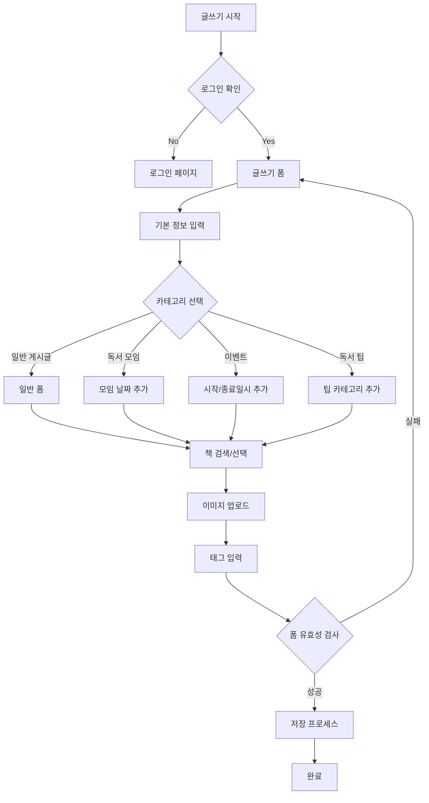

# 글쓰기 로직 설명

## 1. 모델 구조

### 1.1 기본 게시글 모델 (Post)
- 모든 게시글 타입의 기본이 되는 추상 모델
- 공통 필드:
  - 제목 (title)
  - 내용 (content) 
  - 작성자 (writer)
  - 조회수 (views)
  - 이미지 (postimage_set)
  - 생성/수정일 (created_at, updated_at)
  - 상태 플래그 (is_active, is_pinned, is_deleted, is_side_bar)
  - 검색 벡터 (search_vector)
  - 카테고리 (category)
  - 태그 (tags)
  - 좋아요 수 (likes)
  - 연결된 책 (book)

### 1.2 게시글 타입별 모델
1. 일반 게시글 (GeneralPost)
   - 기본 Post 모델 상속
   - 추가 필드 없음

2. 독서 모임 게시글 (ReadingGroupPost)
   - 추가 필드: event_date (모임 날짜)
   - 사이드바 자동 노출 (is_side_bar = True)

3. 독서 팁 게시글 (ReadingTipPost)
   - 추가 필드: tip_category (독서팁/글쓰기팁/기타)
   - 사이드바 자동 노출

4. 이벤트 게시글
   - BookReviewEventPost (서평 이벤트)
   - PersonalBookEventPost (개인 이벤트)
   - BookTalkEventPost (북토크)
   - 공통 추가 필드:
     - event_start_date (이벤트 시작일시)
     - event_end_date (이벤트 종료일시)

## 2. 글쓰기 프로세스

### 2.1 글쓰기 폼 (PostForm)
1. 기본 입력 필드
   - 제목 (title)
   - 내용 (content)
   - 카테고리 선택 (category)
   - 태그 입력 (tags)

2. 카테고리별 추가 필드
   - 독서 모임: event_date
   - 이벤트 게시글: event_start_date, event_end_date

### 2.2 저장 프로세스
1. 폼 유효성 검사
2. 게시글 기본 정보 저장
3. 작성자 정보 연결
4. 책 정보 처리 (선택된 경우)
5. 이미지 처리 (업로드된 경우)
6. 태그 처리
7. 카테고리별 추가 정보 저장

## 3. 주요 기능

### 3.1 이미지 처리
- PostImage 모델을 통한 다중 이미지 저장
- Generic Relations 사용으로 모든 게시글 타입에서 사용 가능

### 3.2 태그 기능
- 쉼표로 구분된 태그 입력
- PostTag 모델에 자동 저장
- 중복 태그 처리

### 3.3 책 연결 기능
- 네이버 책 검색 API 연동
- 선택한 책 정보 자동 저장/연결

### 3.4 사이드바 노출
- ReadingGroupPost와 ReadingTipPost는 자동으로 사이드바에 노출
- is_side_bar 플래그로 관리

## 4. 보안 및 권한

### 4.1 접근 제어
- 비로그인 사용자: 읽기만 가능
- 로그인 사용자: 글쓰기 가능
- 작성자/관리자: 수정/삭제 권한

### 4.2 데이터 보호
- soft delete 구현 (is_deleted 플래그)
- 삭제된 게시물 사이드바 노출 방지
