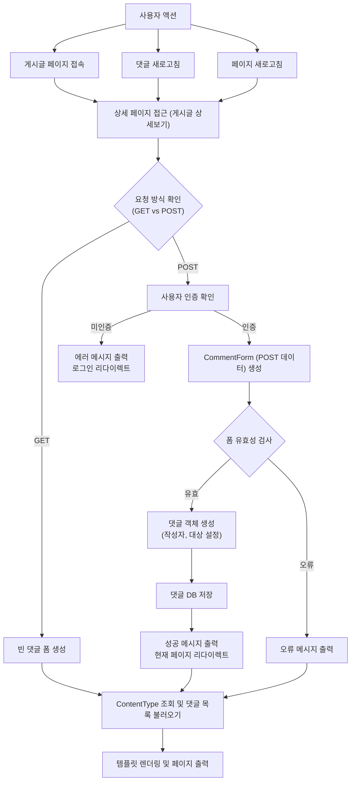

GET 요청은 다음 세 가지 상황에서 발생합니다:

1. 사용자가 게시글 페이지에 처음 접속할 때
2. 댓글 목록을 새로고침할 때
3. 페이지 자체를 새로고침할 때

이러한 GET 요청들은 모두 동일한 처리 흐름을 따르게 되며, 결과적으로 최신 댓글 목록과 함께 페이지를 렌더링하게 됩니다.

2. POST 요청 처리 흐름
인증 확인
미인증 → 로그인 페이지 리다이렉트
인증 → 다음 단계 진행
댓글 처리
CommentForm으로 POST 데이터 처리
폼 유효성 검사
유효한 경우:
댓글 객체 생성 (작성자, 대상 게시글 설정)
DB 저장
성공 메시지와 함께 페이지 리다이렉트
유효하지 않은 경우:
오류 메시지 출력
3. 최종 출력
ContentType 기반으로 댓글 목록 조회
템플릿 렌더링하여 페이지 출력