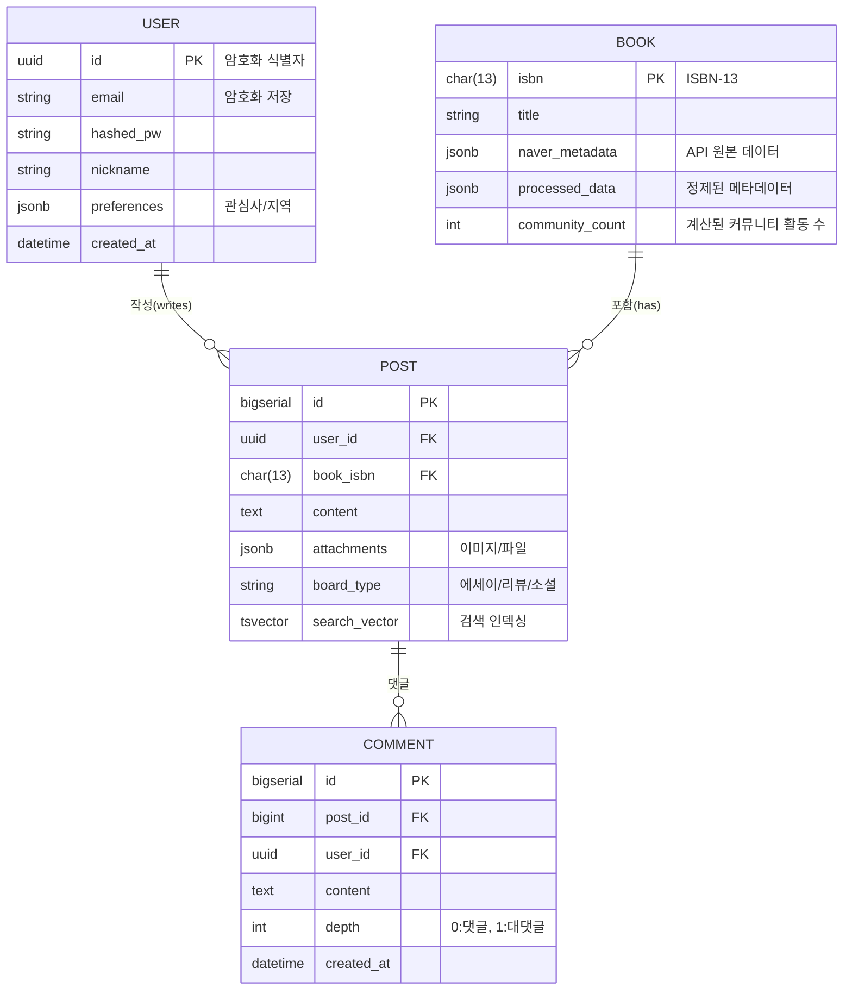
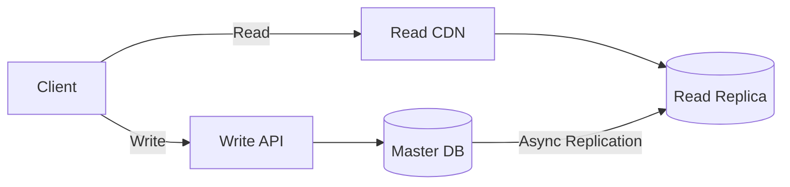
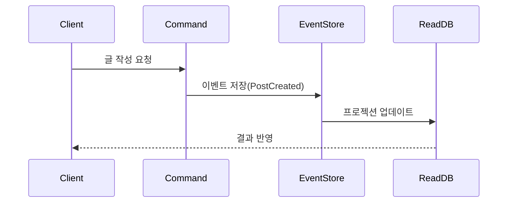
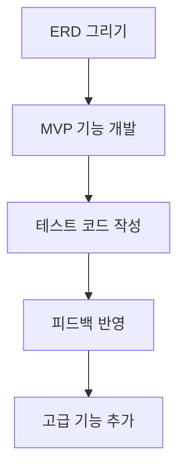

```mermaid
erDiagram
    USER ||--o{ POST : "작성(writes)"
    USER {
        uuid id PK "암호화 식별자"
        string email "암호화 저장"
        string hashed_pw
        string nickname
        jsonb preferences "관심사/지역"
        datetime created_at
    }
    
    BOOK ||--o{ POST : "포함(has)"
    BOOK {
        char(13) isbn PK "ISBN-13"
        string title
        jsonb naver_metadata "API 원본 데이터"
        jsonb processed_data "정제된 메타데이터"
        int community_count "계산된 커뮤니티 활동 수"
    }
    
    POST ||--o{ COMMENT : "댓글"
    POST {
        bigserial id PK
        uuid user_id FK
        char(13) book_isbn FK
        text content
        jsonb attachments "이미지/파일"
        string board_type "에세이/리뷰/소설"
        tsvector search_vector "검색 인덱싱"
    }
    
    COMMENT {
        bigserial id PK
        bigint post_id FK
        uuid user_id FK
        text content
        int depth "0:댓글, 1:대댓글"
        datetime created_at
    }

```

```mermaid
flowchart LR
  Client -->|Write| API[Write API]
  Client -->|Read| CDN[Read CDN]
  API --> Master[(Master DB)]
  CDN --> Replica[(Read Replica)]
  Master -- Async Replication --> Replica
  

```

```mermaid
sequenceDiagram
  Client->>Command: 글 작성 요청
  Command->>EventStore: 이벤트 저장(PostCreated)
  EventStore->>ReadDB: 프로젝션 업데이트
  ReadDB-->>Client: 결과 반영

```

```mermaid
flowchart TB
    A[ERD 그리기] --> B[MVP 기능 개발]
    B --> C[테스트 코드 작성]
    C --> D[피드백 반영]
    D --> E[고급 기능 추가]

```
데이터베이스 [[데이터베이스생성]]