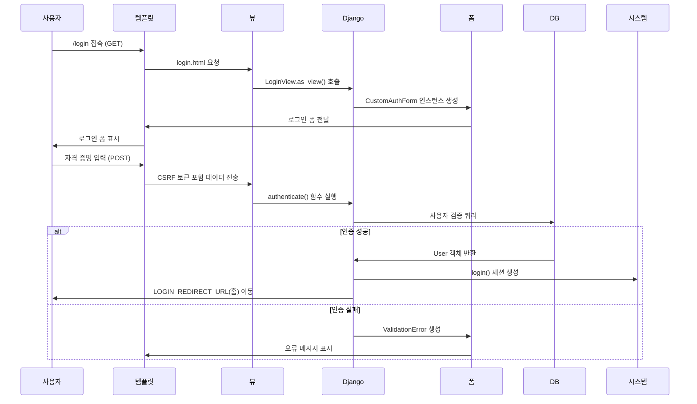

```mermaid

sequenceDiagram
    사용자->>템플릿: /login 접속 (GET)
    템플릿->>뷰: login.html 요청
    뷰->>Django: LoginView.as_view() 호출
    Django->>폼: CustomAuthForm 인스턴스 생성
    폼->>템플릿: 로그인 폼 전달
    템플릿->>사용자: 로그인 폼 표시

    사용자->>템플릿: 자격 증명 입력 (POST)
    템플릿->>뷰: CSRF 토큰 포함 데이터 전송
    뷰->>Django: authenticate() 함수 실행
    Django->>DB: 사용자 검증 쿼리
    alt 인증 성공
        DB->>Django: User 객체 반환
        Django->>시스템: login() 세션 생성
        Django->>사용자: LOGIN_REDIRECT_URL(홈) 이동
    else 인증 실패
        Django->>폼: ValidationError 생성
        폼->>템플릿: 오류 메시지 표시
    end
```
