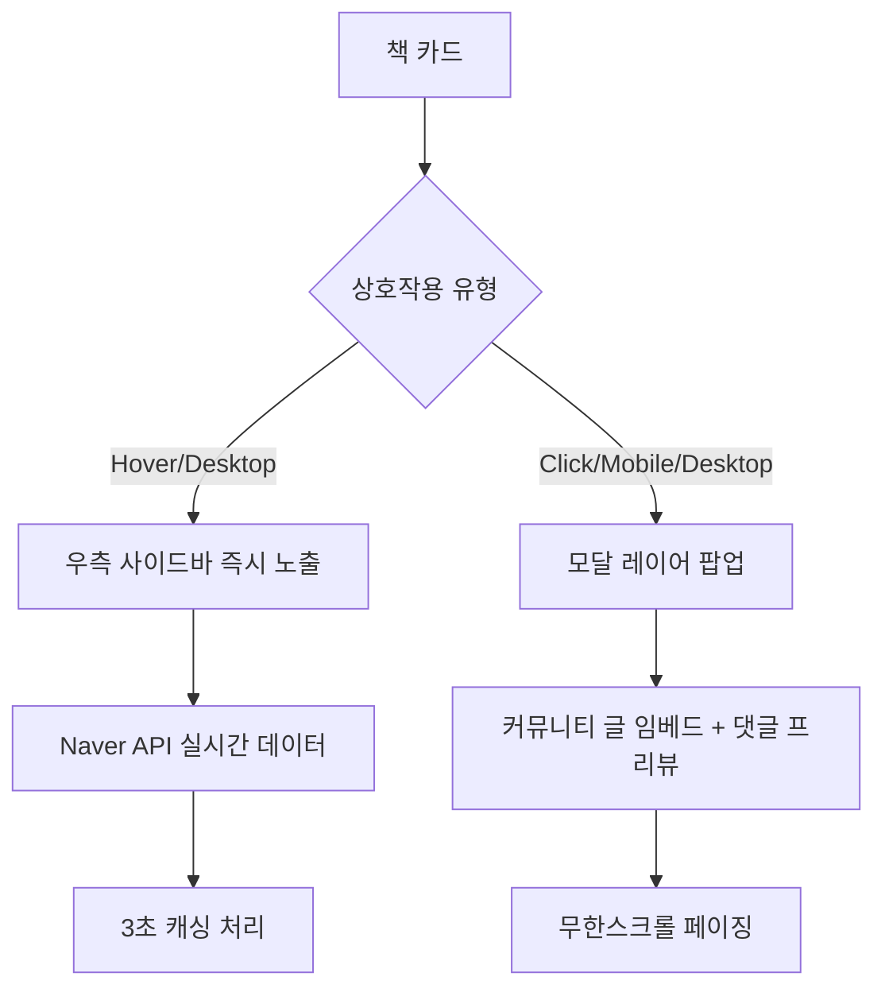
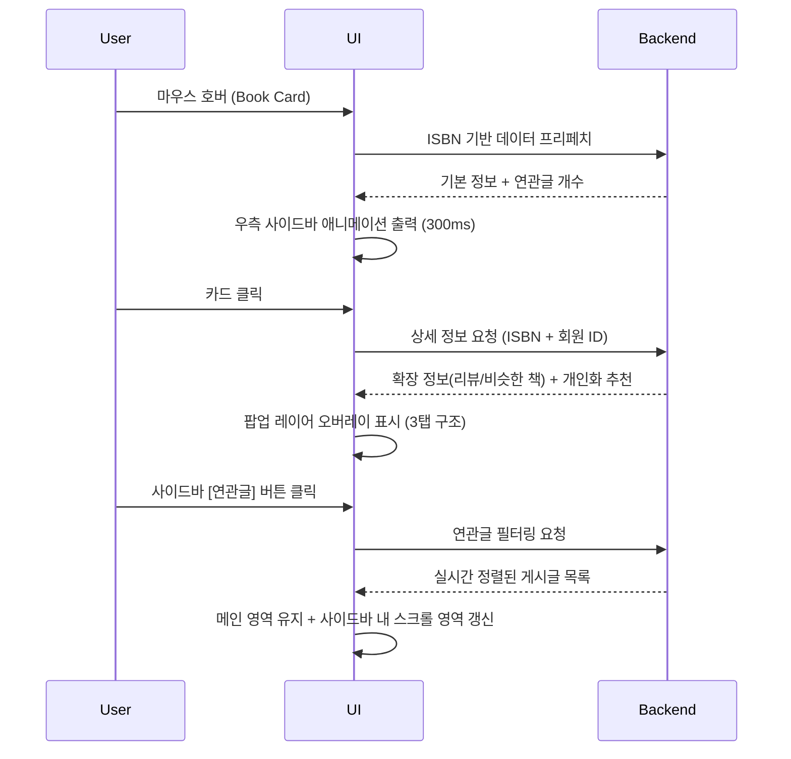

```mermaid
flowchart TD
    A[책 카드] --> B{상호작용 유형}
    B -->|Hover/Desktop| C[우측 사이드바 즉시 노출]
    B -->|Click/Mobile/Desktop| D[모달 레이어 팝업]
    C --> E[Naver API 실시간 데이터]
    D --> F[커뮤니티 글 임베드 + 댓글 프리뷰]
    E --> G[3초 캐싱 처리]
    F --> H[무한스크롤 페이징]

```

```mermaid
sequenceDiagram
    participant User
    participant UI
    participant Backend
    
    User->>UI: 마우스 호버 (Book Card)
    UI->>Backend: ISBN 기반 데이터 프리페치
    Backend-->>UI: 기본 정보 + 연관글 개수
    UI->>UI: 우측 사이드바 애니메이션 출력 (300ms)
    
    User->>UI: 카드 클릭
    UI->>Backend: 상세 정보 요청 (ISBN + 회원 ID)
    Backend-->>UI: 확장 정보(리뷰/비슷한 책) + 개인화 추천
    UI->>UI: 팝업 레이어 오버레이 표시 (3탭 구조)
    
    User->>UI: 사이드바 [연관글] 버튼 클릭
    UI->>Backend: 연관글 필터링 요청
    Backend-->>UI: 실시간 정렬된 게시글 목록
    UI->>UI: 메인 영역 유지 + 사이드바 내 스크롤 영역 갱신
```
