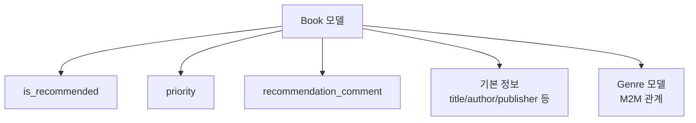

#추천도서 페이지 로직 흐름

## 1.데이터 모델 구조


## 2.데이터 흐름

### 2-1. Admin 패널에서 추천도서 설정


	- is_recommended 필드를 True로 설정하면 추천도서 페이지에 노출됨
    - priority 필드는 추천도서 내 순서를 결정
    - recommendation_comment 필드는 추천도서 페이지에 표시될 짧은 설명

### 2-2. 백엔드 처리


    def recommended_books(request):
        books = Book.objects.filter(
            is_recommended=True,
            is_active=True
        ).order_by('priority', '-created_at'
        ).prefetch_related('genre')
        
        return render(request, 'community/recommend_book.html', {
            'books': books
        })


## 3. 템플릿 렌더링 순서
1. **기본 레이아웃 로드**
   - `base.html` 템플릿 확장
   - 타이틀 설정: "추천도서"

2. **컨테이너 구성**
   ```
   recommended-books-container
   └── recommended-grid
       └── recommended-card (반복)
   ```

3. **각 도서 카드 렌더링**
   ```
   recommended-card
   ├── priority-badge (조건부)
   ├── book-thumbnail-wrapper
   │   └── book-thumbnail
   └── book-info-wrapper
       ├── book-meta
       │   ├── book-title
       │   ├── book-author
       │   └── book-publisher
       ├── recommend-comment (조건부)
       └── genre-tags
   ```

## 4. 주요 기능 및 디자인 요소
### 4.1 우선순위 표시
- `priority` 값이 있는 경우에만 배지 표시
- 낮은 숫자가 더 높은 우선순위

### 4.2 썸네일 처리
- 기본 이미지 폴백 처리
- 호버 시 확대 효과


