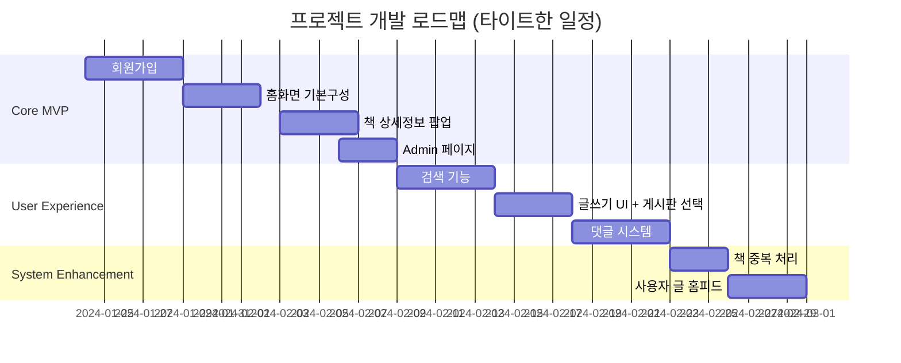

# 프로젝트 우선순위 목록 (Obsidian 용)

## 📌 **1. 최우선 순위 (Core MVP)**
- [ ] **회원가입 기능**  
  _이메일/비밀번호 기반 가입 + 닉네임 필수 입력. 관심사/지역 선택 옵션_
- [ ] **홈 화면 구성**  
  _네이버 API 연동 베스트셀러 표시 + "최신글/인기글" 섹션. 도서 클릭 시 오른쪽 사이드바 기본 UI 구현_
- [ ] **책 정보 카드 클릭 시 추가 정보 출력**  
  _팝업 레이어에 서평글/비슷한 책 추천/기본정보 3탭 구성_
- [ ] **Admin 페이지 기능**  
  _공지사항 CRUD + 도서 정보 일괄 수정 기능_

## 🚀 **2. 고우선 순위 (User Experience)**
- [ ] **검색 기능**  
  _통합 검색창(제목/태그/내용) + 자동완성 API 연동_
- [ ] **글쓰기 기능**  
  _드래그 앤 드롭 이미지 업로드 + 3단계 카테고리 분류_
- [ ] **게시판 선택 기능 추가**  
  _작성 시 "독서토론/중고나눔/자유게시판" 선택 드롭다운_
- [ ] **댓글 기능**  
  _대댓글 2depth 지원 + 실시간 댓글 카운트 업데이트_
- [ ] **책 장르 태그 지정 기능**  
  _유저 태그 클라우드 + 관리자 태그 블랙리스트 관리_

## ⚙️ **3. 중간 순위 (System Enhancement)**
- [ ] **책 중복 처리 기능**  
  _ISBN 기반 중복 검출 알고리즘 + 수동 병합 인터페이스_
- [ ] **사용자 쓴 글 홈페이지 출력**  
  _무한 스크롤 피드 + "추천순/최신순" 필터링_
- [ ] **"사람 소리" 독서 콘텐츠 섹션**  
  _CSS hover transition 0.3s 적용된 아코디언 메뉴_

## 🌟 **4. 향후 개발 (Value-Added Features)**
- [ ] **GPT 책 추천 기능**  
  _유저 독서 히스토리 기반 추천엔진 (OpenAI fine-tuning)_
- [ ] **독서모임 기능**  
  _네이버 지도 API 연동 모임 장소 표시 + 일정 알림_
- [ ] **파르헤시아 & 독서토론**  
  _실시간 웹소켓 채팅 + 투표 시스템_
- [ ] **중고나눔 플랫폼**  
  _결제网关 연동 + 리뷰 시스템_

## 🎨 **5. 디자인 최적화**
- [ ] **왼쪽 사이드바 구성 변경**  
  _3단계 정보 계층화(이벤트→모임→팁) + 아이콘 폰트 적용_
- [ ] **북토크 페이지**  
  _라이브 스트리밍 플레이어 임베드 + Q&A 패널_
---

## 📂 **구현 순서 로드맵**

